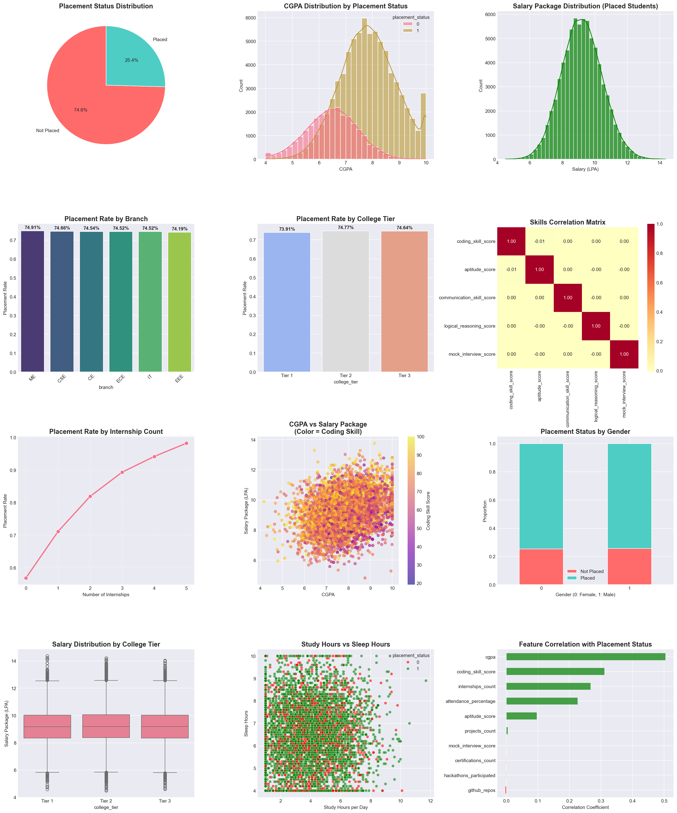

# 🎓 Student Placement Analysis

[](https://www.python.org/downloads/)
[](https://pandas.pydata.org/)
[](LICENSE)

A comprehensive data analysis project exploring factors affecting student placement outcomes using Python, Pandas, NumPy, Matplotlib, and Seaborn.

---

## 📊 Dataset

**Source:** [Kaggle - Student Placement Prediction Dataset 2026](https://www.kaggle.com/datasets/sehaj1104/student-placement-prediction-dataset-2026)

**Size:** 100,000 student records  
**Features:** 26 columns including academic scores, skills, extracurricular activities, and placement outcomes

### Dataset Features

| Category | Features |
|----------|----------|
| **Demographics** | student_id, age, gender |
| **Academic** | cgpa, branch, college_tier, backlogs, attendance_percentage |
| **Technical Skills** | coding_skill_score, aptitude_score, logical_reasoning_score |
| **Soft Skills** | communication_skill_score, mock_interview_score, leadership_score |
| **Experience** | internships_count, projects_count, certifications_count, hackathons_participated |
| **Portfolio** | github_repos, linkedin_connections |
| **Lifestyle** | sleep_hours, study_hours_per_day, extracurricular_score, volunteer_experience |
| **Target** | placement_status, salary_package_lpa |

---

## 🚀 Getting Started

### Prerequisites

```bash
pip install pandas numpy matplotlib seaborn
```

### Installation

1. Clone the repository:
```bash
git clone https://github.com/mukulsarswat/Student-Placement-Analysis.git
cd Student-Placement-Analysis
```

2. Download the dataset from [Kaggle](https://www.kaggle.com/datasets/sehaj1104/student-placement-prediction-dataset-2026) and place it in the project directory.

3. Run the analysis:
```bash
jupyter notebook
```

---

## 📈 Analysis Overview

### 1. Data Exploration & Visualization

The analysis includes comprehensive visualizations to understand placement patterns:

#### Distribution Analysis
- **Placement Status Distribution** - Overall placement rate visualization
- **CGPA Distribution** - Academic performance by placement status
- **Salary Distribution** - Package analysis for placed students


#### Skill Analysis
Violin plots comparing placed vs not placed students across various skills:
- Coding Skill Score
- Communication Skill Score  
- Logical Reasoning Score


#### Experience Impact
- Internships vs Placement Rate
- Hackathons Participation
- Projects and Certifications


### 2. Correlation Analysis

Heatmap showing relationships between numeric features and placement success:


### 3. Demographic Insights

- Age-wise placement trends
- Gender-based analysis
- Branch-wise salary comparison
- College tier impact



### 4. Key Findings

| Insight | Finding |
|---------|---------|
| **Placement Rate** | ~74.6% overall placement rate |
| **CGPA Impact** | Strong correlation with placement success |
| **Internships** | Higher internship count → Better placement chances |
| **Coding Skills** | Critical factor for high salary packages |
| **Attendance** | Positive correlation with placement |

---

## 📊 Visualizations Included

1. **Line Plot** - Age distribution by branch and gender
2. **Violin Plots** - Skills comparison (placed vs not placed)
3. **Count Plots** - Backlogs distribution
4. **Bar Plots** - College tier vs coding scores
5. **Histograms** - Age distribution by gender
6. **Scatter Plots** - CGPA vs GitHub repos
7. **Heatmaps** - Salary analysis by college tier and branch
8. **Box Plots** - Coding scores by placement status
9. **Pie Charts** - Overall placement distribution

---

## 🛠️ Technologies Used

- **Python 3.8+**
- **Pandas** - Data manipulation and analysis
- **NumPy** - Numerical computing
- **Matplotlib** - Static visualization
- **Seaborn** - Statistical data visualization

---

## 📁 Project Structure

```
Student-Placement-Analysis/
│
├──  student_placement_prediction_dataset_2026.csv
│
├──  placement_analysis.ipynb
│
├── comprehensive_analysis.png
│
├── README.md
```

---

## 🔍 Sample Code

```python
import numpy as np
import pandas as pd
import seaborn as sns
import matplotlib.pyplot as plt

# Load dataset
data = pd.read_csv("student_placement_prediction_dataset_2026.csv")
df = pd.DataFrame(data)

# Placement distribution
placement_counts = df['placement_status'].value_counts()
colors = ['#FF6B6B', '#4ECDC4']
labels = ['Not Placed', 'Placed']
plt.pie(placement_counts.values, labels=labels, autopct='%1.1f%%', 
        colors=colors, startangle=90)
plt.title('Placement Status Distribution')
plt.show()

# CGPA vs Placement
sns.histplot(data=df, x='cgpa', hue='placement_status', bins=30, kde=True)
plt.title('CGPA Distribution by Placement Status')
plt.show()

# Feature correlation
numeric_features = ['cgpa', 'coding_skill_score', 'aptitude_score', 
                   'internships_count', 'attendance_percentage']
correlations = df[numeric_features].corr()['placement_status']
correlations.plot(kind='barh')
plt.title('Feature Correlation with Placement')
plt.show()
```

---

## 🎯 Key Takeaways

1. **Academic Performance Matters** - CGPA is a strong predictor of placement success
2. **Practical Experience Counts** - Internships significantly improve placement odds
3. **Technical Skills are Crucial** - Coding skills correlate with higher salaries
4. **Holistic Development** - Communication and logical reasoning skills matter
5. **Consistency Pays Off** - Regular attendance shows positive correlation

---

## 🤝 Contributing

Contributions are welcome! Please feel free to submit a Pull Request.

1. Fork the repository
2. Create your feature branch (`git checkout -b feature/AmazingFeature`)
3. Commit your changes (`git commit -m 'Add some AmazingFeature'`)
4. Push to the branch (`git push origin feature/AmazingFeature`)
5. Open a Pull Request

---

## 📝 License

This project is licensed under the MIT License - see the [LICENSE](LICENSE) file for details.

---

## 🙏 Acknowledgments

- Dataset provided by [Sehaj1104 on Kaggle](https://www.kaggle.com/datasets/sehaj1104/student-placement-prediction-dataset-2026)
- Inspired by educational data science projects
- Thanks to the open-source community for amazing tools
